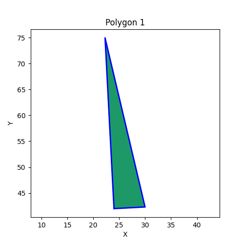
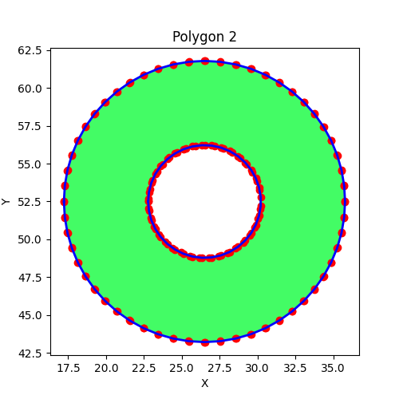
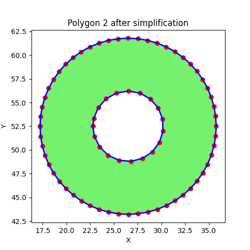
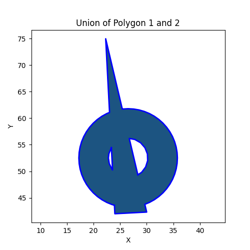
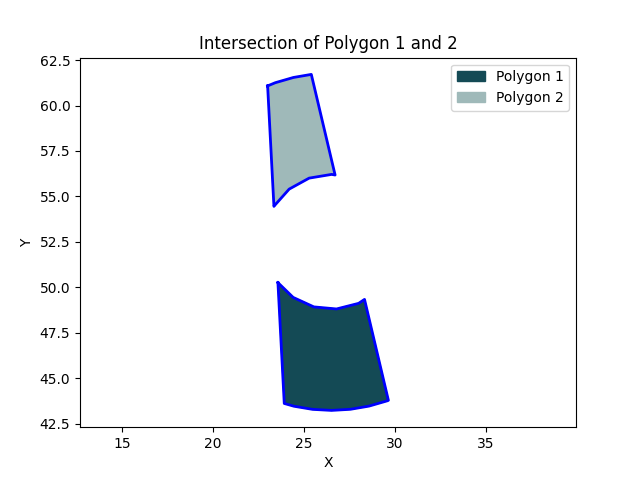
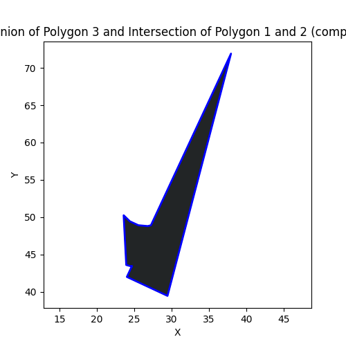

# Polygon Module Documentation

## Overview

This module provides classes and functions for representing, manipulating, and visualizing polygons, including support for complex polygons (with holes), unions, intersections, and simplification. It uses NumPy for array operations, Matplotlib for plotting, and Shapely for geometric operations.

---
## Requirements

- Python 3.12
- NumPy
- Matplotlib
- Shapely

See `requirements.txt` for details.

---
## Installation

To set up the required Python environment and install all dependencies, use the provided `install_env.sh` script. This script will create a virtual environment and install all packages listed in `requirements.txt`.

### Steps

1. **Open a terminal and navigate to the project directory:**
   ```bash
   cd /path/to/polygon_union
   ```

2. **Run the installation script:**
   ```bash
   bash install_env.sh
   ```

3. **Activate the virtual environment:**
   ```bash
   source env_union/bin/activate
   ```

4. **Verify installation:**
   - All required packages (`numpy`, `matplotlib`, `shapely`, etc.) will be installed automatically.
   - You can check installed packages with:
     ```bash
     pip list
     ```

### Notes

- The script will create a virtual environment in the `env_union` folder.
- If you need to install additional packages, add them to `requirements.txt` and rerun the script.
- For more details, see the contents of `install_env.sh`.


---
## Running unite_polygons.py with Command-Line Arguments

The script `unite_polygons.py` can be executed from the command line to process two polygon files (`.npz`) and perform either a union or intersection operation. The results are saved as images in the specified output directory.

### Usage

```bash
python unite_polygons.py -p1 <path_to_polygon1.npz> -p2 <path_to_polygon2.npz> [options]
```

### Arguments

- `-p1`, `--poly1`  
  Path to the first polygon file (required).

- `-p2`, `--poly2`  
  Path to the second polygon file (required).

- `-o`, `--output`  
  Output directory to save the result images (default: `./output`).

- `-op`, `--operation`  
  Operation to perform: `union` or `intersection` (default: `union`).

- `-s`, `--simplify`  
  Apply polygon simplification before performing the operation (optional flag).

### Example Commands

**Union of two polygons:**
```bash
python unite_polygons.py -p1 ./NumpyFiles/arrays_90.npz -p2 ./NumpyFiles/arrays_2.npz -op union -o ./output
```

**Intersection of two polygons with simplification:**
```bash
python unite_polygons.py -p1 ./NumpyFiles/arrays_90.npz -p2 ./NumpyFiles/arrays_2.npz -op intersection -s -o ./output
```

### Output

- The resulting plot will be saved in the output directory as either:
  - `union_polygon1_polygon2.png`
  - `intersection_polygon1_polygon2.png`

- Additional plots for the input polygons are also displayed.


**Note:**  
Make sure to activate your virtual environment before running the script if you installed dependencies using `install_env.sh`.

---

## Usage Code Example (Step-by-Step)

This code example demonstrates how to import the class and define, manipulate, and visualize polygons, including saving each plot as an image file. See `example.py` to learn more.

### 1. Define and Rotate Polygon #1

Manually define a triangle, reverse its vertices for clockwise orientation, and rotate it by 3 degrees.

```python
manual_poly = [[24,42], [30,42], [24,75], [24,42]]
manual_poly = np.array(manual_poly[::-1]) # Clockwise
poly1 = complex_polygon([manual_poly])
poly1.rotate(angle_deg=3, origin=(24,42))
poly1.plot_polygon(title_legend="Polygon 1")
```


### 2. Load and Plot Polygon #2 from File

Load a complex polygon from a NumPy `.npz` file.

```python
poly2 = complex_polygon()
poly2.read_polygon_from_npz_file("./NumpyFiles/arrays_90.npz")
poly2.plot_polygon(plot_vertices=True, title_legend="Polygon 2")
```


### 3. Simplify Polygon #2

Simplify polygon #2 to reduce the number of vertices (using a larger distance threshold).

```python
poly2.apply_polygon_simplification(distance_threshold=1e-0)
poly2.plot_polygon(plot_vertices=True, title_legend="Polygon 2 after simplification")
```


### 4. Union of Polygon #1 and #2
Compute the union of polygons #1 and #2.

```python
result = poly1.unify_polygons(poly2)
result.plot_polygon(title_legend="Union of Polygon 1 and 2")

if isinstance(result, multi_complex_polygon):
    result = result.get_polygon(0)
```


### 5. Intersection of Polygon #1 and #2
Compute the intersection of polygons #1 and #2.

```python
result_int = poly1.intersect_polygons(poly2)
result_int.plot_polygon(title_legend="Intersection of Polygon 1 and 2")

if isinstance(result_int, multi_complex_polygon):
    result_int = result_int.get_polygon(0)
```


### 6. Create and Rotate Polygon #3
Create a third polygon from the manual definition and rotate it by -25 degrees.

```python
poly3 = complex_polygon([manual_poly])
poly3.rotate(angle_deg=-25, origin=(24,42))
```

### 7. Union of Polygon #3 with the Intersection of #1 and #2
Compute the union of polygon #3 with the intersection result from step 5.

```python
poly3.unify_polygons(result_int).plot_polygon(title_legend="Union of Polygon 3 and Intersection of Polygon 1 and 2 (comp 1)")
```

### Summary
Each step demonstrates a key feature of the module, and the corresponding figure is saved for visualization and further analysis.

---
## Notes

- Polygons are sorted by area (descending) in `complex_polygon`.
- Orientation is determined by signed area: OUTER (clockwise, negative area), HOLE (counter-clockwise, positive area).
- Supports geometric operations using Shapely.
- Polygon simplification helps reduce vertex
- Unified handling of union/intersection results (single or multiple polygons).
- More robust loading from `.npz` files.

---
## Class Diagram

```mermaid
+-----------------------------------+
|   simple_polygon                  |
+-----------------------------------+
| - vertices                        |
| - _signed_area                    |
| - orientation                     |
| - perimeter                       |
+-----------------------------------+
| +get_area()                       |
| +get_perimeter()                  |
| +get_orientation()                |
| +rotate()                         |
| +simplify_collinear()             | 
| +simplify_by_distance()           |
| +apply_polygon_simplification()   |
+-----------------------------------+

                    ^
                    |
                    | contains
                    |
          +-----------------------------------+
          |  complex_polygon                  |
          +-----------------------------------+
          | - polygons                        |
          | - area                            |
          | - perimeter                       |
          +-----------------------------------+
          | +get_area()                       |
          | +get_perimeter()                  |
          | +get_outer_polygons()             |
          | +get_hole_polygons()              |
          | +rotate()                         |
          | +plot_polygon()                   |
          | +unify_polygons()                 |
          | +intersect_polygons()             |
          | +apply_polygon_simplification()   |
          | +read_polygon_from_npz_file()     |
          +-----------------------------------+

                                ^
                                |
                                | contains
                                |
                      +-----------------------------------+
                      |  multi_complex_polygon            |
                      +-----------------------------------+
                      | - complex_polygons                |
                      +-----------------------------------+
                      | +get_area()                       |
                      | +get_perimeter()                  |
                      | +plot_polygon()                   |
                      | +get_polygon()                    |
                      +-----------------------------------+
```

---

## Classes

### `simple_polygon`
Represents a single polygon defined by its vertices.

- **Attributes:**
  - `vertices`: List or array of polygon vertices.
  - `orientation`: Clockwise (outer) or counterclockwise (hole).
  - `perimeter`, `_signed_area`: Cached geometric properties.

- **Key Methods:**
  - `get_area(absolute=True)`: Returns the (absolute or signed) area.
  - `get_perimeter()`: Returns the perimeter.
  - `rotate(angle_deg, origin)`: Rotates the polygon.
  - `simplify_collinear(tol)`: Removes collinear vertices.
  - `simplify_by_distance(threshold)`: Removes close vertices.
  - `apply_polygon_simplification(collinear_tol, distance_threshold)`: Applies both simplifications.

### `complex_polygon`
Represents a collection of polygons (outer and holes).

- **Attributes:**
  - `polygons`: List of `simple_polygon` objects.
  - `area`, `perimeter`: Cached total area and perimeter.

- **Key Methods:**
  - `get_area()`, `get_perimeter()`: Total area/perimeter.
  - `get_outer_polygons()`, `get_hole_polygons()`: Retrieve outer/hole polygons.
  - `rotate(angle_deg, origin)`: Rotates all polygons.
  - `plot_polygon(...)`: Plots the polygons using Matplotlib.
  - `unify_polygons(poly2, _op)`: Union or intersection with another `complex_polygon`.
  - `intersect_polygons(poly2)`: Intersection with another `complex_polygon`.
  - `apply_polygon_simplification(...)`: Simplifies all polygons.
  - `read_polygon_from_npz_file(file_path)`: Loads polygons from a `.npz` file.

### `multi_complex_polygon`
Represents a collection of `complex_polygon` objects (e.g., result of union/intersection).

- **Attributes:**
  - `complex_polygons`: List of `complex_polygon` objects.

- **Key Methods:**
  - `get_area()`, `get_perimeter()`: Total area/perimeter.
  - `plot_polygon(...)`: Plots all polygons.
  - `get_polygon(index)`: Retrieves a polygon by index.
